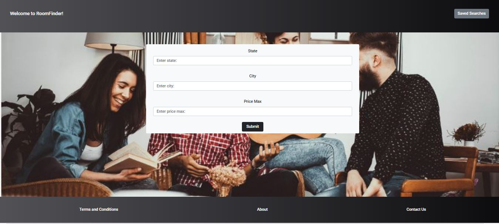
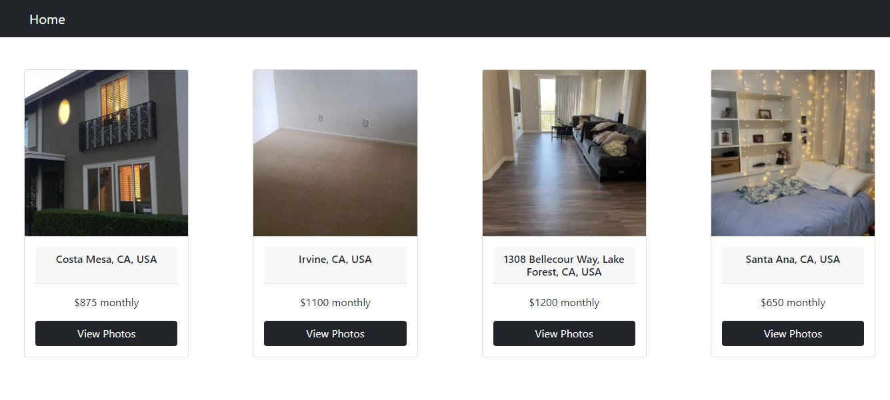
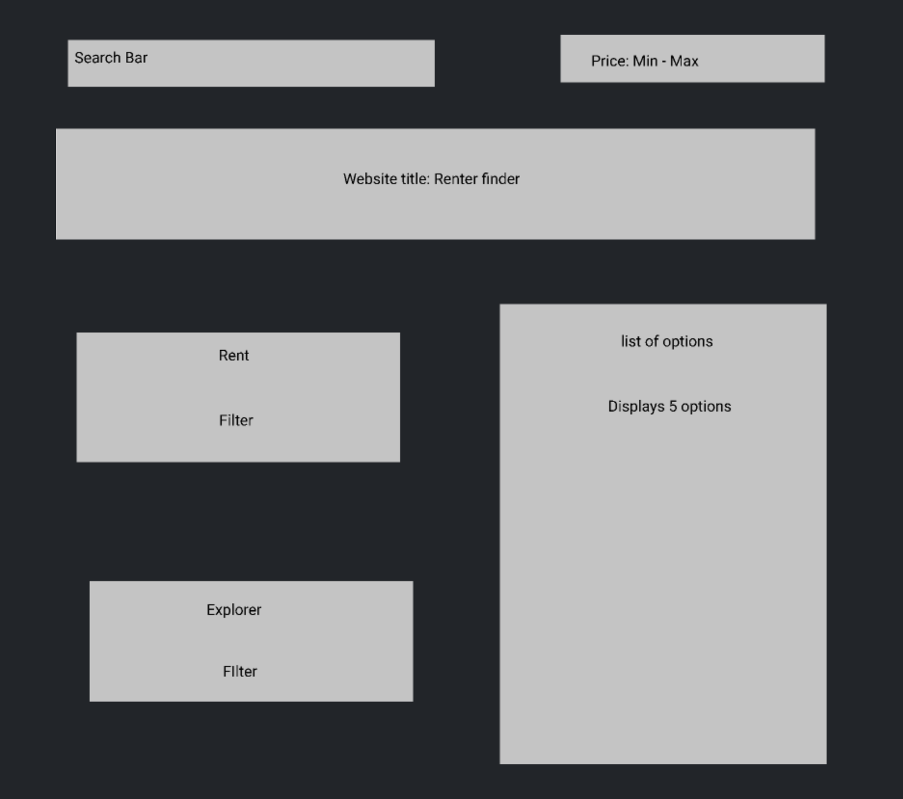

# <RoomFinder>
## Description

Live application deployed at:https://asharif123.github.io/project-one/

*** What is RoomFinder?**

A website to search for a new place to live.

***Why RoomFinder?***

On RoomFinder, users can explore housing options nationwide. The motivation for this project originated from the stress of looking for new place that fits our budget. For Example, the user could be looking for something close to work or simply looking for an entirely new location. Whatever the reason or cause the objective of our project is to simplfy the search. We are using 3 key components for user search. The user will search by the state of interest, the city of interest, and most importantly their budget. Searching for a new place can take time and a lot of research. The user will be presented with mulitple options containing: addresses, images, and budget. Our users will have the option to save their searches, so they may later revist certain properties that caught their eye during a previous search.

*** How does RoomFinder work?**

When the user visits the homepage they will find a user friendly interface. 

The user will be present with a form, which they will need enter the state, city, and budget. 

Once the user completes these search parameters they will be presented with their results based on the information they have entered.

The results will contain a photo, the address, monthly cost, and an option for view photos of the properties. 
  

When the user selects view photos, images of the selected property will display.

The user will be presented with a home option and back to results option.
  

When the user selects the home button they will be directed to the home page.

Once the user if directed to the home page they will have the option to visit their saved searches 

When the user selects the back to results options they will be directed to the results page to explore other results. 

## Prototypes

## Credits
List your collaborators, if any, with links to their GitHub profiles.
If you used any third-party assets that require attribution, list the creators with links to their primary web presence in this section.
If you followed tutorials, include links to those here as well.

Developers: 

Delmy Elias
https://github.com/Dlelias

Mason Newell
https://github.com/MasonNewell

Awad Sharif
https://github.com/asharif123

Braulio Mora
https://github.com/BraulioCP59

## License
The last section of a high-quality README file is the license. This lets other developers know what they can and cannot do with your project. If you need help choosing a license, refer to [https://choosealicense.com/](https://choosealicense.com/).

