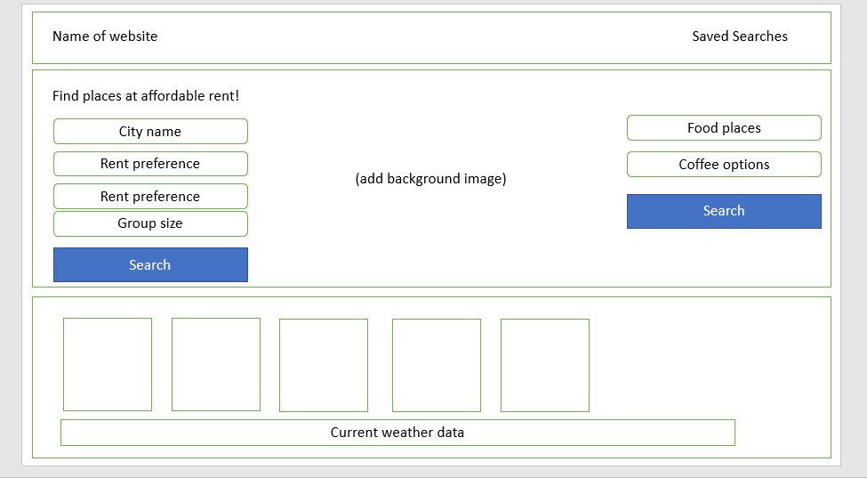

# <roomFinder>
## Description
Provide a short description explaining the what, why, and how of your project. Use the following questions as a guide:
- We are motiviated by the struggle. Finding a good place that fits our budget, commute and lifestyles can be difficult. 
- So we built roomFinder to get rid of all the guess work. We built roomFinder with ease of use in mind.
- On roomFinder users can explore housing options nationwide, connect with those who inhabit the space and select from an array of local experiences to make new friends. 


## Usage
Landing Page: 
    ```md
    
    ```

Viewing Search Results:
    ```md
    
    ```


## Credits
List your collaborators, if any, with links to their GitHub profiles.
If you used any third-party assets that require attribution, list the creators with links to their primary web presence in this section.
If you followed tutorials, include links to those here as well.

Developers: 

Delmy Elias
https://github.com/Dlelias

Mason Newell
https://github.com/MasonNewell

Awad Sharif
https://github.com/asharif123

Braulio Mora
https://github.com/BraulioCP59

## License
The last section of a high-quality README file is the license. This lets other developers know what they can and cannot do with your project. If you need help choosing a license, refer to [https://choosealicense.com/](https://choosealicense.com/).

